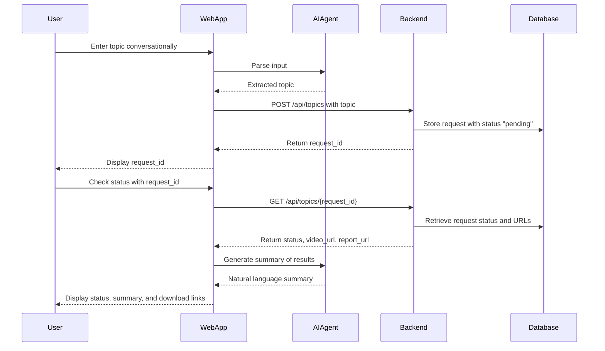
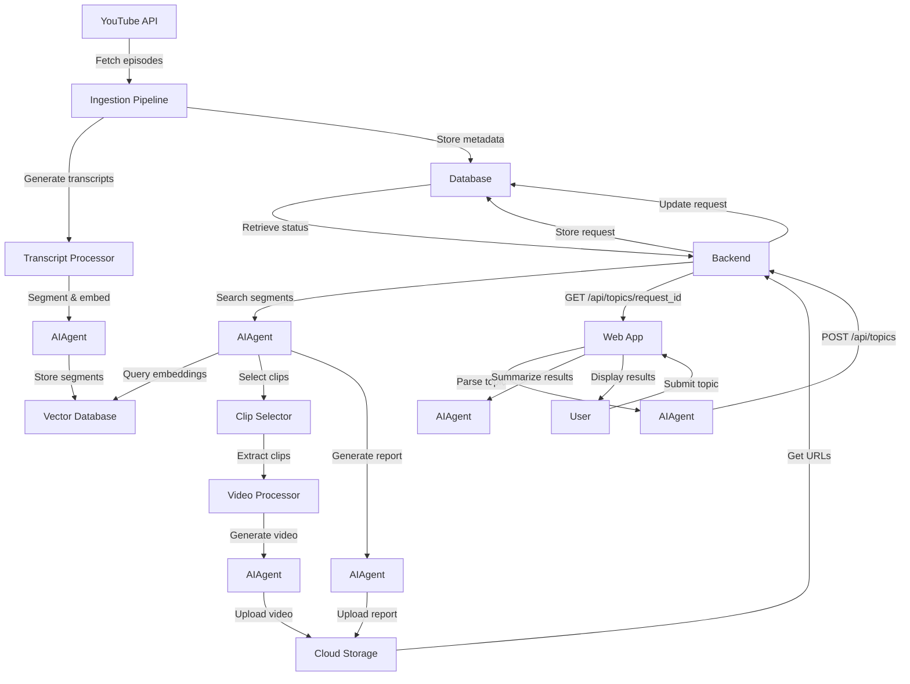

# Workflow Component Diagram for "What would Joe Rogan say?" App

## 1. User Workflows

Users interact with the system through a simple and intuitive process:

1. **Input Topic**: Users access the web app, encounter the prompt "What would Joe Rogan say about ....?", and type a topic into a text input form.
2. **Submit Topic**: Users submit the topic, triggering backend processing.
3. **Receive Request ID**: The system returns a unique request ID for tracking purposes.
4. **Check Status**: Users can use the request ID to monitor the processing status.
5. **Download Results**: Upon completion, users receive links to download a summary video and a timestamp report.

### Mermaid Diagram: User Journey

## 2. Data Flows

Data progresses through the system in a structured manner, from ingestion to final output:

1. **Ingestion**: The system periodically retrieves new Joe Rogan Experience (JRE) episodes from YouTube, generates transcripts, and stores them in a database.
2. **Topic Submission**: A user-submitted topic is logged in the database with a "pending" status.
3. **Topic Processing**: The backend searches transcripts for relevant segments, selects clips, produces a summary video, and compiles a timestamp report.
4. **Storage and Delivery**: The generated video and report are uploaded to cloud storage, and the database is updated with their URLs and a "completed" status.

### Mermaid Diagram: Data Flow

## 3. Integration Points

The system connects with external services and internal components as follows:

- **YouTube Data API**: Retrieves episode metadata and available transcripts.
- **Speech-to-Text Vertex AI Service**: Produces transcripts for episodes lacking them.
- **Vector Database (Google Cloud)**: Stores transcript segments with vector embeddings for fast similarity searches.
- **Cloud Storage (Google Cloud Storage)**: Stores summary videos and timestamp reports for user access.
- **Task Queue (e.g., Celery with Redis)**: Handles asynchronous topic processing to ensure scalability.

## 4. Error Handling

The system incorporates robust error management to maintain reliability:

- **Ingestion Failures**: Log errors and retry fetching episodes or transcript generation after a delay.
- **Processing Failures**: If topic processing fails (e.g., video extraction errors), update the request status to "failed" and log details for debugging.
- **User Errors**: Return clear error messages and appropriate HTTP status codes (e.g., 400 Bad Request) for invalid inputs like empty topics.
- **Rate Limiting**: Enforce usage limits to prevent abuse, responding with 429 Too Many Requests when exceeded.
- **Timeout Handling**: Apply timeouts to prolonged operations (e.g., video processing), updating the request status and informing the user as needed.

This diagram outlines the essential workflows, data movements, integrations, and error handling strategies, serving as a practical blueprint for developing the "What would Joe Rogan say about that?" app.